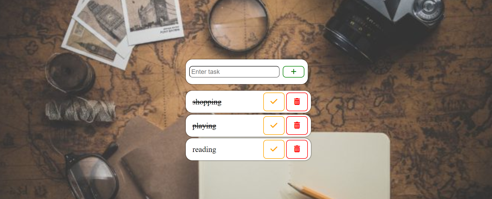

# To-Do App

A simple To-Do application built with JavaScript that allows users to add, view, and delete tasks.

## Features

- **Add Tasks**: Add new tasks to your to-do list.
- **View Tasks**: View all tasks in your to-do list.
- **Delete Tasks**: Remove tasks from your to-do list using the delete button.

### Usage

1. **Add a task:**
    - Enter the task name in the input field.
    - Click the "Add" button or press "Enter" to add the task to the list.

2. **View tasks:**
    - All added tasks will be displayed in a list below the input field.

3. **Delete a task:**
    - Click the "Delete" button next to the task you want to remove from the list.

### Snapshot of the App

